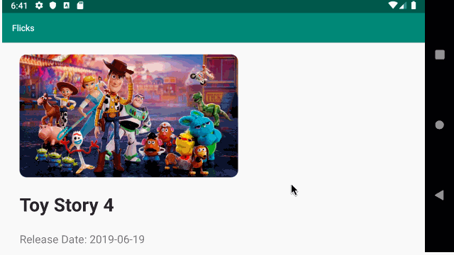

# Project 2 - Flicks

Flicks shows the latest movies currently playing in theaters. The app utilizes the Movie Database API to display images and basic information about these movies to the user.

Time spent: 15 hours spent in total

## User Stories

The following **required** functionality is completed:

* [x] User can **scroll through current movies** from the Movie Database API

The following **stretch** features are implemented:

* [x] For each movie displayed, user can see the following details:
  * [x] Title, Poster Image, Overview (Portrait mode)
  * [x] Title, Backdrop Image, Overview (Landscape mode)
* [x] Display a nice default [placeholder graphic](https://guides.codepath.org/android/Displaying-Images-with-the-Glide-Library#advanced-usage) for each image during loading
* [x] Allow user to view details of the movie including ratings and popularity within a separate activity
* [x] Improved the user interface by experimenting with styling and coloring.
* [x] Apply rounded corners for the poster or background images using [Glide transformations](https://guides.codepath.org/android/Displaying-Images-with-the-Glide-Library#transformations)
* [ ] Apply the popular [Butterknife annotation library](http://guides.codepath.org/android/Reducing-View-Boilerplate-with-Butterknife) to reduce boilerplate code.
* [x] Allow video trailers to be played in full-screen using the YouTubePlayerView from the details screen.

## Video Walkthrough

Here's a walkthrough of implemented user stories:

1. Portrait

2. Landscape

GIF created with [LiceCap](http://www.cockos.com/licecap/).

## Notes

Describe any challenges encountered while building the app.

It took me a while to fully grasp the concepts of intents and parcels and how to communicate and send data from one screen/ activity
to another.

I had some trouble styling using the layout system, specifically relative and constraint layouts. The way they work is somewhat
different from what I'm used to in web-development i.e CSS and JS.

## Open-source libraries used

- [Android Async HTTP](https://github.com/loopj/android-async-http) - Simple asynchronous HTTP requests with JSON parsing
- [Glide](https://github.com/bumptech/glide) - Image loading and caching library for Android
- [YoutubeView](https://developers.google.com/youtube/android/player/reference/com/google/android/youtube/player/YouTubePlayerView) - Youtube player for android.

## License

    Copyright [2019] [Christopher Kinyua]

    Licensed under the Apache License, Version 2.0 (the "License");
    you may not use this file except in compliance with the License.
    You may obtain a copy of the License at

        http://www.apache.org/licenses/LICENSE-2.0

    Unless required by applicable law or agreed to in writing, software
    distributed under the License is distributed on an "AS IS" BASIS,
    WITHOUT WARRANTIES OR CONDITIONS OF ANY KIND, either express or implied.
    See the License for the specific language governing permissions and
    limitations under the License.
